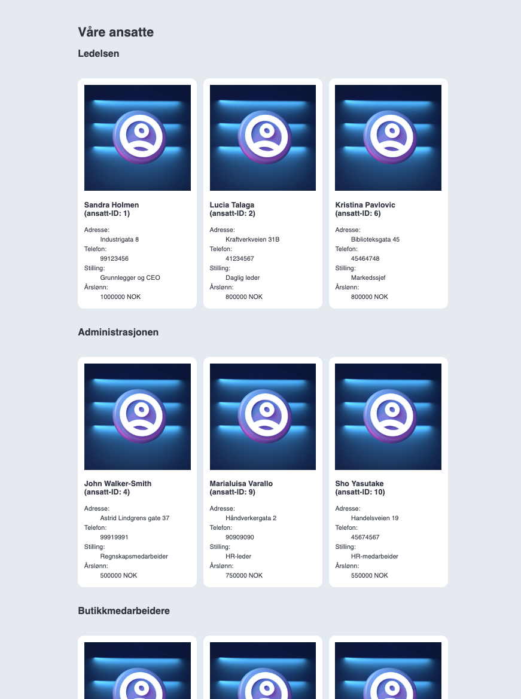

# Ansattregister

## Caset

En liten spesialforretning i byen har 10 ansatte. Systemene deres er ganske gamle og fragmenterte; de har ett register med ansatte som inneholder navn, adresse og telefonnummer, ett register som inneholder hvilken rolle og avdeling den ansatte tilhører, og ett register som inneholder årslønn.

Bedriften ønsker seg nå en side med utlisting av alle de ansatte der all informasjonen står, slik at de ikke trenger å jakte mellom flere systemer for å finne det de trenger. I tillegg ønsker de seg at de ansatte sorteres på avdeling, slik at det er litt enklere å finne ut hvem som jobber hvor uten å måtte lese alle registrene fra topp til bunn.

## Tekniske krav / hva du skal gjøre i oppgaven

Du får ikke endre `index.html`-fila i denne oppgaven. I `scripts/script.js` ligger det tre variabler kalt `personRegister`, `salaryRegister` og `roleRegister`. Disse inneholder arrays som representerer de tre registrene du skal slå sammen, og du får ikke endre noe av informasjonen i disse.

For å få til utlistingen vist i skjermbildet må du slå sammen informasjonen i de tre forskjellige registrene til ett enkelt array. Arrayet skal inneholde et objekt for hver ansatt der all informasjonen ligger. Denne heter `createNewRegister()` og ligger som en tom funksjon i `scripts/script.js`-fila. Denne funksjonen skal du fylle ut sånn at den gjør det som trengs.

Det skal lages en funksjon som tegner ut ett enkelt ansattkort som vist i grensesnittet. Denne heter `createEmployeeCard()` og tar i mot ett parameter: et objekt som representerer en ansatt. Denne funksjonen skal returnere HTML-koden som tegner opp ansattkortet. Du velger selv hvilken HTML-kode du synes er best å bruke her, og du kan style så mye eller så lite du vil med CSS. Denne funksjonen ligger også tom i `scripts/script.js` og kan fylles ut.

Til sist skal du lage en funksjon som heter `renderEmployees()`. Denne funksjonen kjøres når siden er ferdig med å laste, og skal lage og tegne ut all HTML-koden i dokumentet. Denne funksjonen skal kalle på de to andre funksjonene du har laget ved behov slik at løsningen blir tegnet opp som tiltenkt (se skjermbildet som ligger i `assets/images/overview.png` for et eksempel). Denne funksjonen ligger også tom i `/scripts/script.js`.

## Hvilke konsepter må jeg kunne for å løse oppgaven?

+ Hva arrays er til og hvordan de brukes.
+ Hva objekter er til og hvordan de brukes.
+ Hvordan løkker fungerer, fortrinnsvis `for`.
+ Hvordan du henter og manipulerer HTML-elementer med `document.querySelector()` og lignende.
+ Hva template literals er og hvordan disse virker.
+ Hva konkatenasjon av strenger er.

**Lykke til!**